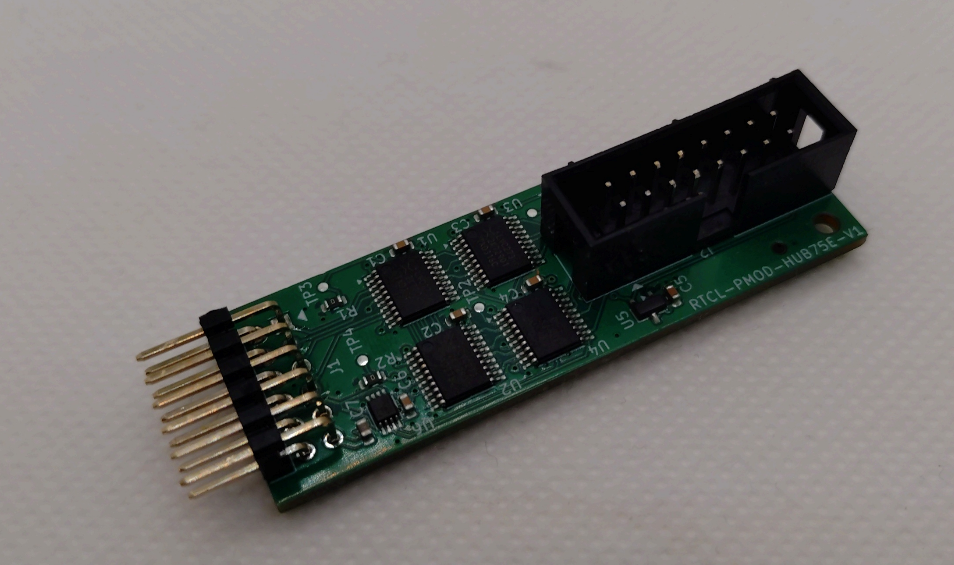

# HUB-75E LEDパネルを PMOD １個で駆動する基板

## 概要

HUB75E 形式の LED パネルを PMOD １個で駆動するための変換基板です。

Sipeed さんの [PMOD_HUB75E](https://wiki.sipeed.com/hardware/en/tang/tang-PMOD/FPGA_PMOD.html) だと PMOD コネクタが２個必要で、KV260 などのように PMOD コネクタが１個しかない FPGA ボードでは利用できません。

そこで PMOD 一個からデュアルエッジでデータを出して 64x64 の LED パネルを駆動するための基板を設計しました。

## 変換基板のイメージ

下記のような変換基板です。

PMOD コネクタ一個から HUB-75E LED パネルを駆動します。

## 各種データ

回路図は[こちら](rtcl-pmod-hub75e.pdf)です。

[KiCAD](https://www.kicad.org/) version 10.0.1 で設計しております。

[JLCPCB](https://jlcpcb.com/) さんの4層基板で製造を想定しております。

手元での試作は JLCPCB さんの PCBA で行っており、各自で製造される場合は必要に応じて部品を選定ください。

## 動作テスト

下記のプロジェクトなどで動作テストを行っております。

- https://github.com/ryuz/rtcl-designs/tree/develop/projects/kv260/kv260_rtcl_hub75e_sample

LED パネルの表示確認や各種パラメータの調整を行っております。

## 免責事項

本設計データは、研究開発用の試作実験に用するものであり、利用に際して発生した如何なる損害も作者は補償いたしませんので予めご了承ください。

## ライセンス(License)

本設計データは、[クリエイティブ・コモンズ 表示-非営利 4.0 国際 ライセンス](https://creativecommons.org/licenses/by-nc/4.0/deed.ja)の下で提供されています。

製造した本基板の販売や配布を行わない限りは、趣味や研究開発用途でご自由にお使いいただく事が出来ます。
また、商用に製造販売を希望される場合は、別途ライセンス契約を作者までご相談ください。

## 作者情報

渕上 竜司(Ryuji Fuchikami)
[リアルタイムコンピューティング研究所](https://rtc-lab.com/)

